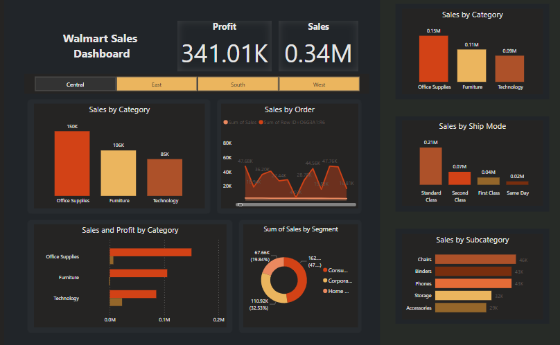

# Walmart Sales Dashboard
A multipage app built with Django and Vuejs for managing VMs from vSphere through API.
## Local Setup

### Tools
- Power Bi

### Steps

1. Clone the repository from using the command:

```bash
git clone https://github.com/ManahilAhmed/Walmart-Sales-Dashboard.git
``` 

2. Run ```Walmart.pbix``` file


Output

